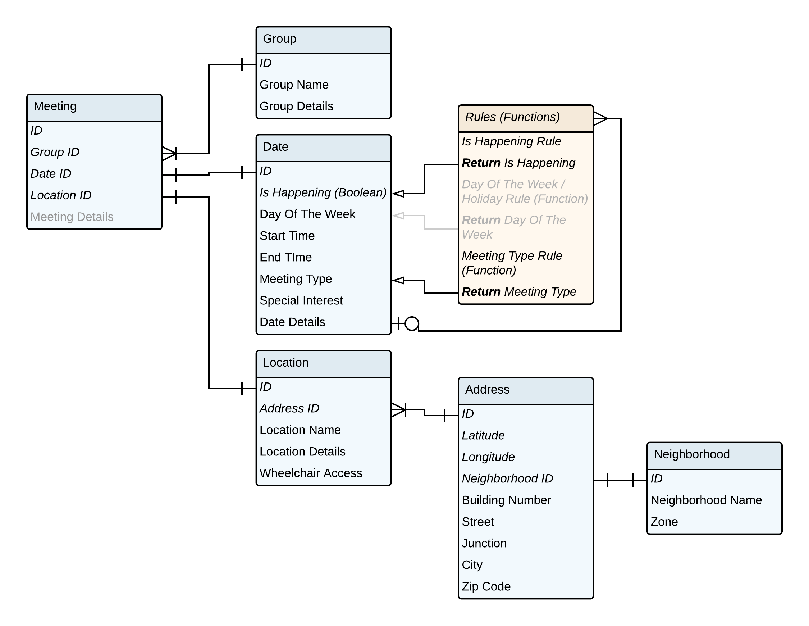

Felix Buchholz
MS Data Visualization @ Parsons NYC, Fall 2018, Data Structures, Aaron Hill

# Assignment 4

## Assignment description (shortened)
Original description [here](https://github.com/visualizedata/data-structures/blob/master/assignments/weekly_assignment_04.md)

> #### Part One: Plan
> Draw a data model for the AA meetings data to be stored in a database. Include all the content/data/variables from the source file that you believe to be relevant, even if you haven't parsed it yet. Upload an image (png format) of your drawing to your GitHub repository.
>
> Some decisions that will help with this drawing:
>
> 1. Will you use a Normalized Data Model or a Denormalized Data Model? Why?
> 2. When the data comes back out of the database, how should it be structured? Why?
> 3. How would you describe the hierarchy of the data?
>
> #### Part Two: Create a table(s) in your database
>
With the help of the pg module in Node:
>
> 1. Create a new table.
> 2. Remove (delete!) a table.
> 3. Query a table.
>
>
> #### Part Three: Populate your database
> Use the pg module in Node to insert your AA data in the database you created. Hint: check to make sure you have the correct number of rows! Note: it is not expected that this data be complete and clean yet. For now, just insert the documents/data you have.


## My approach

### Part One

1. I want to use a Normalized Data Model. I think it has advantages in maintenance and without having any experience that seems an advantage to me when controlling if data was parsed correctly. The disadvantage of complexity when joining data is not a huge downside in this particular case, because the number of different tables still seems manageable and also the number of connections I need to make is probably fixed and not that high.
2. From where I stand right now I think the easiest way to handle the date would be an array of JavaScript objects (probably of the table meetings), that have the data of the tables nested in them, because I can think when the data comes back, that’s the easiest to handle for me in JavaScript and d3 for example.
3. I really have a hard time to reason for my drawing in terms of what we learned in Hills book. I can’t explain the relations in terms of classes and types for example. So I tried to do it more intuitively and as I understand it the data is structured on at least three hierarchy levels:
    1. Meetings are the highest hierarchy level.
    2. Groups, Dates and Locations are one level lower but on the same level
    3. For Locations it would make sense to introduce a sub-level, Addresses and maybe even another one below that (I would suggest for neighborhood).

- I included one element in my drawing (in **yellow**) that I think can’t be implemented in the tables, but interests me programmatically: I would be interested in how to code the rules that are sometimes added in the detailed descriptions and explain when meetings are not happening on holidays or if meeting types change according to the sequence of weeks in the current month.

- I used italics to highlight columns that I only need for the _backend_.
- Elements in grey are elements that I can imagine to be useful, but I haven’t yet found one example to proof it.




### Part Two

- Installing pg via npm
```js
// npm install pg
```
- Following the [instructions](https://github.com/visualizedata/data-structures/blob/master/assignments/weekly_assignment_04_documentation.md) to set up a relational database instance on AWS, keeping track of my credentials and used them to modify the starter code

- Experimenting with the starter code and a test file I created with just one address element in it. I went through creating, removing and querying a table.

- I didn’t really keep a separate file for this because I wanted to learn and experiment a bit more with ways to deal with asynchronous code. So I challenged myself to **join Part Two and Part Three in one file:**

### Part Three

``` javascript
/*      Non-working roadmap for my code      */
// Require: all the npm packages I want to use
const dotenv, async, fs, pg = require('package');

// Global
var addressesForDb;
  // Timeout setting for the SQL row insert
var myPopTimer = 300;

  // AWS RDS POSTGRESQL INSTANCE
let db_credentials = new Object();
db_credentials.user .host .database .password .port
const client = new Client(db_credentials);

// *** FUNCTIONS ***

let loadDataset = () => {/* */};

let queryTable = (queryString) => {/* */}

  // Frequent queries shortcut
let findQuery = (myOp, myTable) => {
  if (myOp == 'create') {
    return `CREATE TABLE ${myTable} (address varchar(100), /* */ `;
  }
  /* */
}

// Populate Table with data
let populateTable = (myTable) => {
  async.eachSeries(addressesForDb, function(value, callback) {
      /* */
      setTimeout(callback, myPopTimer);
  });
}

//Check row count on Table by comparison to the original data
let checkTable = (myTable) => {
  console.log(/* */addressesForDb.length);
  queryTable(findQuery('count', myTable));
}

// *** Async series ***

let myAsync = () => {

  async.series({
      // Example for the object notation of async.series, the other properties of the object follow the same structure
      loadData: (callback) => {
        setTimeout(function(){
              loadDataset()
              callback(null, 1); // See control flow example: https://github.com/caolan/async/blob/v1.5.2/README.md#control-flow-1
          }, 500);

      createTable: /* */ queryTable(findQuery('create', 'aageoaddresses')); /* */,
      populateTable: /* */,
      checkTable: /* */
        setTimeout(function(){
          /* */
        }, myPopTimer*addressesForDb.length+(myPopTimer*2));
        // ! Time for all inserts, according to the dataset length
  /* */
  }
}

// Finally execute this to run the whole thing
myAsync();
```

This time there is also enough comments in the code to make it easier to come back to.
This is still not the solution I hoped for: It would be nicer not having to manage setTimeout timers, but have callbacks or promises instead (I guess), but I’m still trying to find a good structure that I can easily read and understand myself to implement this. 
