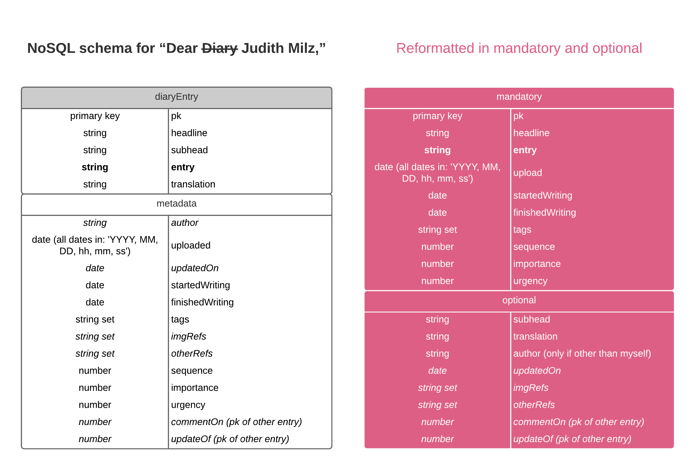

Felix Buchholz
MS Data Visualization @ Parsons NYC, Fall 2018, Data Structures, Aaron Hill

# Assignment 5

## Assignment description (link)
Original description [here](https://github.com/visualizedata/data-structures/blob/master/assignments/weekly_assignment_05.md)

## My approach

### Part One

1. I will use a Denormalized Data Model, because the content of each entry will be very different _horizontally_ and _vertically_. I won’t need all the variables I define for every entry, and the content of some variables might vary drastically over the entries.

2. When the data comes back I want to be able to easily use it in a very flat structure to position it’s content on an (imaginary) map in the browser, that’s why I decided not to nest any structures.

3. Hence, the hierarchy is very flat, it’s just the entry and all it’s properties are on the same level




### Part Two

I use an object to pass my parameters to the class constructor, which is just a way for me to keep a better overview what I’m doing, when I write entries. For the variables that I consider optional, I first autocasting, but then decided to leave them out with conditionals, if I don’t need them, which seems the better denormalized approach. I left the autocasting in the code, maybe as a fallback but more for later reference.

``` javascript
class DiaryEntry {
  constructor(obj) {
    //Primary key
    this.pk = {};
    this.pk.N = obj.pk.toString();

    //Essentials
    this.headline = {};
    this.headline.S = obj.headline;
    if (obj.subhead != null) {
      this.subhead = {};
      this.subhead.S = obj.subhead || 'empty';
    }
    this.entry = {};
    this.entry.S = obj.entry;
    if (obj.translation != null) {
      this.translation = {};
      this.translation.S = obj.translation || 'empty';
    }

    // Only when author is someone else
    this.author = {};
    this.author.S = obj.author || 'Felix Buchholz';

    //Dates
    this.uploaded = {};
    this.uploaded.S = obj.uploaded.toDateString();
    if (obj.updatedOn != null) {
      this.updatedOn = {};
      this.updatedOn.S = typeof obj.updatedOn != 'undefined'? obj.updatedOn.toDateString() : new Date(1970, 0, 1, 0, 0, 0).toDateString();
    }
    this.startedWriting = {};
    this.startedWriting.S = obj.startedWriting.toDateString();
    this.finishedWriting = {};
    this.finishedWriting.S = obj.finishedWriting.toDateString();

    // Tags and references
    this.tags = {};
    this.tags.SS = obj.tags;
    if (obj.imgRefs != null) {
      this.imgRefs = {};
      this.imgRefs.SS = obj.imgRefs || ['empty'];
    }
    if (obj.otherRefs != null) {
      this.otherRefs = {};
      this.otherRefs.SS = obj.otherRefs || ['empty'];
    }

    // Ordering and linking of entries
    this.sequence = {};
    this.sequence.N = obj.sequence.toString();
    this.importance = {};
    this.importance.N = obj.importance.toString();
    this.urgency = {};
    this.urgency.N = obj.urgency.toString();
    if (obj.commentOn != null) {
      this.commentOn = {};
      this.commentOn.N = typeof obj.commentOn != 'undefined'? obj.commentOn.toString() : '-1';
    }
    if (obj.updateOf != null) {
      this.updateOf = {};
      this.updateOf.N = typeof obj.updateOf != 'undefined'? obj.updateOf.toString() : '-1';
    }
  }
}
```

#### My first entry

``` javascript
diaryEntries.push(
  new DiaryEntry({
    pk: 0,

    headline: 'Dear ~Diary~ Judith Milz,',
    subhead: 'An Attempt to Collect and Map',
    entry: `I want this to be a tool to collect the ideas, anecdotes, stories, we share maybe a map of our “Brieffreundschaft” or even – hopefully – it can be a tool to collaborate as well, if it’s not too technical or indirect and then at least document its failure. Then it may only be a place for me to collect my ideas. I feel uncomfortable writing to you in English, so I might soon switch to German and offer a English translation, comment or summary instead.

    I think in the end I want this to be a website with just one page wich is scrollable vertically and horizontally and which shows all the entries positioned according to the time they were written and proximity by relations, this is where the tags will come in handy. The typography should reflect the tags (which can include moods) and very different topics could be juxtaposed. There might also be a filtering or sorting option to generate different outcomes of this map`,
    // translation : '',

    // author: '',
    uploaded: new Date(),
    // updatedOn: new Date(1970, 0, 1, 0, 0, 0),
    startedWriting: new Date(2018, (10-1), 12, 12, 00, 00),
    finishedWriting: new Date(2018, (10-1), 12, 12, 31, 00),

    tags: ['introduction', 'mainIntroduction', 'thisConcept', 'English'],
    // imgRefs: [''],
    // otherRefs: [''],

    sequence: 0,
    importance: 6,
    urgency: 5,
    // commentOn: ,
    // updateOf:
}));

```

This entry also explains my concept. I quoted it again for better legibility:

>I want this to be a tool to collect the ideas, anecdotes, stories, we share maybe a map of our “Brieffreundschaft” or even – hopefully – it can be a tool to collaborate as well, if it’s not too technical or indirect and then at least document its failure. Then it may only be a place for me to collect my ideas. I feel uncomfortable writing to you in English, so I might soon switch to German and offer a English translation, comment or summary instead.
>
>I think in the end I want this to be a website with just one page wich is scrollable vertically and horizontally and which shows all the entries positioned according to the time they were written and proximity by relations, this is where the tags will come in handy. The typography should reflect the tags (which can include moods) and very different topics could be juxtaposed. There might also be a filtering or sorting option to generate different outcomes of this map


### Part Three

I reused the async code from assignment 4 and adjusted the respective variable names. Access Key ID and Secret Access Key are again in the environment. **IMPORTANT for later reference**, the user with this Access KEY ID is currently **only in the group with permissions to DynamoDB**, to use it for something else I would need to extend these permissions or use another user.

``` javascript
//REQUIRE
var AWS = require('aws-sdk');
var async = require('async');
require('dotenv').config()

AWS.config = new AWS.Config();
AWS.config.accessKeyId = process.env.AWS_ID;
AWS.config.secretAccessKey = process.env.AWS_KEY;
AWS.config.region = "us-east-1";

var dynamodb = new AWS.DynamoDB();

// Upload this
async.eachSeries(diaryEntries, function(value, callback) {
  console.log(value);
    var params = {};
    params.Item = value;
    params.TableName = "deardiary";

    dynamodb.putItem(params, function (err, data) {
      if (err) console.log(err, err.stack); // an error occurred
      else     console.log(data);           // successful response
    });
  setTimeout(callback, 1000);
});
```

For the future, I don’t want to overwrite old entries, but still keep everything in one file, so I think, I’ll introduce something like a currentUploadIndex, which holds a number to keep track, what has been already uploaded in the diaryEntries array.

``` javascript
// <------------------------------------------------ CURRENT ENTRIES
// IMPORTANT CURRENT UPLOAD INDEX
currentUploadIndex = 3+1; // x+1, = diaryEntries.length
diaryEntries = diaryEntries.slice(currentUploadIndex)
console.log(diaryEntries);
```

## PS

I updated the structure a bit, so most of the variables are optional now, because I want to track updates (in a very naive way too) and those updates should only contain:

1. pk
2. upload
3. startedWriting
4. finishedWriting
5. updateOf

and those variables that have changed.
