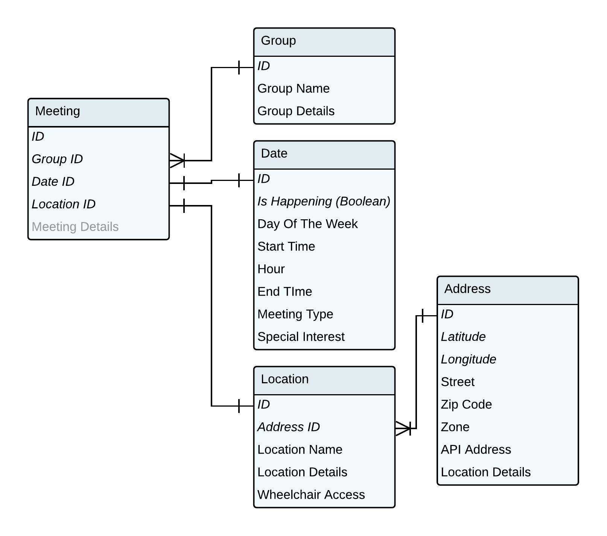

Felix Buchholz
MS Data Visualization @ Parsons NYC, Fall 2018, Data Structures, Aaron Hill

# Assignment 7

## Assignment description

[Link](https://github.com/visualizedata/data-structures/blob/master/assignments/weekly_assignment_07.md)

For this assignment I worked together with Batool and Andrew. We decided to consult each other but work according to our own data structures and write our own code.

## My approach

I broke the assignment down into 5 steps:

1. Request the files from https://parsons.nyc/aa/ (see also assignment 1)
2. Parse the files (This is the important step for this assignment)
3. Geolocate the addresses (see also assignment 3)
4. Create the tables in my postgreSQL database (see also assignment 4)
5. Populate the tables with the parsed data (see also assignment 4)

### Step 2: Parsing the data

This took me quite a while, because I wanted to use the parsing step also as an opportunity to make the proper primary key and foreign key relations between my tables, clean the data, and remove duplicates. I think my approach was therefore a mix of a procedural and an object-oriented approach and it got a bit messy because different goals are entwined and following each other line by line.

While working on the code I decided to re-structure my tables slighty:




I populate arrays and count the primary keys to keep track of the relations between the tables and duplicates.

``` javascript
let meetings = [];
let meetingPK = 1;

let meetingTable = [];
let groupTable = [];
let locationTable = [];
let addressTable = [];
let dateTable = [];

let zone = 1;
let groupPK = 0;
let locationPK = 0;
let addressPK = 0;
let datePK = 1;
```

The lowest level of nested loops begins with reading a individual text file that holds the content from the request in step 1. Then it is loaded by cheerio and assigned to the variable **$**. At the end of the loop the zone counter is incremented.

``` javascript
async function processFiles(paths) {
  for (const path of paths) {
      console.log('******************************************');
      console.log(path);

    const content = await readFile(path);
    const $ = cheerio.load(content);

    // (…)
    /* all the other looping is happening here */
    // (…)

  }) // rows
  zone++;
} // for … of paths
```

The next lower level loops through all the rows.

``` javascript
row.each((rowIndex, rowElem) => {

  // The data I want to parse is in the table row
  // with this particular style:
  // margin-bottom:10px
  if ($(rowElem).attr('style') == 'margin-bottom:10px') {

    // (…)

    // The second one contains the time, type and special interest information
    const secondTD = $('td', rowElem).eq(1);

    // (…)
  }
})
```

The information on the dates, which is the most granular data (that is the table with the most rows) is held in the original html structure in the second \<td\> element.

I needed to split this element on two \<br\> tags with a lot of whitespace in between. (I still get a lot of empty elements)

```javascript
const dateArr = secondTD
      .html()
      .trim()
      .split('<br>\n                    \t<br>');
```

The **key idea** follows then by creating every object and tracking the relations and removing the duplicates for every time there is a single _date_ information.

But first I have to account for the unwanted elements in the dateArr:

``` javascript
dateArr.forEach((dateElem, dateIndex) => {

  // only if the line starts with a day
  // create a date object with the information
  const isDay = dateElem.match(/[SMTWF]\w+?days/g)
  if (isDay != null && isDay != undefined && isDay != '') {

    // (…)
    /* parsing, counting and duplicate removing is happening here */
    // (…)

  }
})
```

The next step is to check if I already have an element like the current one in my table. See the example for the group object:

```javascript
// CREATE GROUP OBJECT
let group;
// Test if the element is already in the table, this is getting slow after a couple of zones
// Notice the ! – it’s not found!
if (!groupTable.some(e => e.name === getGroupName($, firstTD))) {
    // If it wasn’t increment the primary key
    groupPK++;
    // and create the object
    group = {
      groupPK: groupPK,
      name: getGroupName($, firstTD).replace(/[\s]+/g, ' '),
      description: getDetails('group', firstTD),
      scheduleDetails: getDetails('date', firstTD),
    }
    // After its creation it should go into the group array to be able to check the following elements for duplicates
    groupTable.push(group)
} else {
  // If it was found in the if condition we have to find the primary key of this group to be keep track of the right primary key – foreign key relationship
  const tableIndex = groupTable.findIndex(function(e) {
    return e.name == getGroupName($, firstTD)
  })
  group = {
    groupPK: groupTable[tableIndex].groupPK,
    name: getGroupName($, firstTD).replace(/[\s]+/g, ' '),
    description: getDetails('group', firstTD),
    scheduleDetails: getDetails('date', firstTD),
  }
  // groupTable.push(group) /* DO NOT PUSH HERE */
}
```

The principal is similar for all my tables and objects, respectively but I needed to do more checking on the location because the information was not as reliable: I could not only check if the location description was the same, for example “basement”, but also needed to know if it had the same address. I couldn’t figure out how to do that with some() and findIndex(), so I wrote it myself:

``` javascript
let location;
let equalDetails;
let equalAddress;
let equalLocation;
let tableIndex = -1
for (var i = 0; i < locationTable.length; i++) {
  if (locationTable[i].details.join() == getDetails('location', firstTD).join()) {
    equalDetails = true;
    if (locationTable[i].addressFK == address.addressPK) {
      equalAddress = true;
      tableIndex = i;
    }
  }
}
equalLocation = equalDetails && equalAddress;
if (!equalLocation) {
    locationPK++;
    console.log('new', locationPK);
    location = {
      locationPK : locationPK,
      name : $('h4', firstTD).text(),
      details : getDetails('location', firstTD),
      wheelchairAccess : $(rowElem).text().includes('Wheelchair')? true : false,
      addressFK: address.addressPK
    }
    locationTable.push(location);
} else {
  console.log('old', tableIndex);
  location = {
    locationPK : locationTable[tableIndex].locationPK,
    name : $('h4', firstTD).text(),
    details : getDetails('location', firstTD),
    wheelchairAccess : $(rowElem).text().includes('Wheelchair')? true : false,
    addressFK: address.addressPK
  }
}
```


After all the objects have been created and duplicates have been removed I can create my meeting object, push it to the meeting table and increment the meeting and date primary keys:


``` javascript
const justMeetingTable = {
  meetingPK: meetingPK,
  groupFK: group.groupPK,
  dateFK: datePK,
  locationFK: location.locationPK,
}

meetingTable.push(justMeetingTable)
datePK++;
meetingPK++;
```

At the end I’m writing a json file for every table and a json file that is nested to 1 level to check my relations.

``` javascript
writeFile('data/parsed/parsed-nested-1level.json', JSON.stringify(meetings, null, 2));
writeFile('data/parsed/parsed-meetingTable.json', JSON.stringify(meetingTable, null, 2));
writeFile('data/parsed/parsed-groupTable.json', JSON.stringify(groupTable, null, 2));
writeFile('data/parsed/parsed-addressTable.json', JSON.stringify(addressTable, null, 2));
writeFile('data/parsed/parsed-locationTable.json', JSON.stringify(locationTable, null, 2));
writeFile('data/parsed/parsed-dateTable.json', JSON.stringify(dateTable, null, 2));
// console.log('Done!');
```

With the parsing itself I got a bit crazy and I don’t want to elaborate to much on it. But I spent a lot of time to re-format the additional information and separate it into either location information, group description details or schedule details. Even though the function is quite long for this, I think it’s quite readable and self-explanatory (I hope):

``` javascript
function getDetails(selectedDetails, firstTD) {
  const regH4 = /\<h4.*\<\/h4\>/s;
  const regB = /\<b.*<\/b>/s;
  const regSpan = /<span.*<\/span>/s;
  const regN = /[\n]+/gs;
  const regT = /[\t]+/g;
  const regS = /[\s]+/g;
  const regFirstComma = /^(.+?),/;
  const regBetw = /Between\s|Btwneen\s|Betw\.|Betw\s|Btw\.\s|Btw\s|Btwn\.\s/gi;
  const regApos = /&apos;/gi;
  const regQuot = /&quot;/gi;
  const regDash = /&#x2013;|-\D|–/gi;
  const regAnd = /and\s|&amp;|\s&\s/g;
  const regParO = /\(/g;
  const regParC = /\)/g;
  const regWk = /Wk/g;
  const regEq = /=/g
  const regThru = /thru\s/g;
  const regMon = /Mon\.|Mon\s|Mon\)/g;
  const regTue = /Tue\.|Tue\s|Tues(?!d)/g;
  const regWed = /Wed\.|Wed\s/g;
  const regThu = /Thu\.|Thu\s|Thurs\.|Thu\)/g;
  const regFri = /Fri\.|Fri\s/g;
  const regSat = /Sat\.|Sat\s/g;
  const regSun = /Sun\.|Sun\s/g;
  const regTradition = /\bT\s|Trad\.|Trad\s|Tradition\s(?!m)/g;
  const regFriFri = /Friday\sFriday/gi;
  const regComma = /,/g;
  const regBr = /<br>/g;
  const regNum = /#’s/g;
  const regAnniv = /Anniv\s|Anniv\./gi;
  const regFullSt = /\./g;
  const regNoSmoke = /non – smoking/gi;


  let myCleanTD = firstTD.html().trim()
    .replace(regQuot, `'`)
    .replace(regApos, '’')
    // .replace(regDash, ' – ')
    .replace(regNoSmoke, 'non-smoking')
    .replace(regH4, '')
    .replace(regB, '')
    .replace(regSpan, '')
    .replace(regN, '')
    .replace(regT, '')
    .replace(regBetw, ' between ')
    .replace(regAnd, ' and ')
    // :)
    .replace('S and M', 'S&M')
    .replace('NY', '')
    .replace(/\d{5}/, '')
    .replace(regFirstComma, '')
    .replace(regBr, ';')
    .replace('<div class="detailsBox">', '')
    .replace('</div>', ';')

    .replace("AAvenue", 'Amsterdam Avenue')
    .replace("Amsterdam Avenues", 'Amsterdam Avenue')
    .replace("Bway", 'Broadway')
    .replace("Columbuis Avenue", 'Columbus Avenue')
    .replace('CPW', 'Central Park West')

    .replace('(English-Spanish)', 'English-Spanish')

    .replace('Addtl', 'additional')
    .replace('Wheelcahir', 'Wheelchair')
    .replace('GLBT', 'LGBT')
    .replace('Disc.', 'Discussion')
    .replace('ENT', 'ENTER')
    .replace('Rm ', 'Room ')
    .replace(regThru, 'through ')
    .replace('Ave.', 'Avenue')
    .replace('Wkshp', 'Workshop')
    .replace('St.', 'Street')
    .replace('wk.', 'week')
    .replace(regWk, 'Week')
    .replace('Blvd.', 'Boulevard')
    .replace('Sts', 'Streets')
    .replace('St ', 'Street ')
    .replace(regEq, ' = ')
    .replace(regMon, 'Monday ')
    .replace(regTue, 'Tuesday ')
    .replace(regWed, 'Wednesday ')
    .replace(regThu, 'Thursday ')
    .replace(regFri, 'Friday ')
    .replace(regSat, 'Saturday ')
    .replace(regSun, 'Sunday ')
    .replace(regTradition, ' Tradition meeting ')
    .replace(regNum, 'Numbers')
    .replace(regAnniv, 'Anniversary ')
    .replace('. All', ', all')
    .replace(/\*+/gi, '')
    // .replace(regFullSt, ' ')


    .replace('As Bill See it', 'As Bill Sees It')

    //
    .replace(regParO, '')
    .replace(regParC, ';')
    .replace(regComma, ', ')
    .replace(' ,', ', ')
    .replace(regS, ' ')
    // .replace('.', '')

    .trim()

    myCleanTD = myCleanTD.split(';')

    let myEvenCleanerTD = []
    myCleanTD.forEach((e, i) => {

      e = e.replace(regFriFri, 'Friday, Friday').trim().replace(' ,', ', ').replace(/,$/, '').replace(/^,/, '').replace(/\.$/, '').trim();
      e = e.charAt(0).toUpperCase() + e.slice(1);;
      if (e.length > 1) {
        myEvenCleanerTD.push(e);
      }
    })

    myCleanTD = myEvenCleanerTD

  let locationDetails = [];
  const locationIdentifiers = [
    /chapel/i,
    /floor/i,
    /off/i,
    /^between/i,
    /^@/i,
    /stairs/i,
    /room/i,
    /enter\s/i,
    /Entrance/i,
    /building/i,
    /basement/i,
    /lower level/i,
    /door/i,
    /gym/i,
    /hall/i,
    /way/i,
    /street/i,
    /avenue/i,
    /desk/i,
    /Rectory/i,
    /Cafeteria/i,
    /Library/i,
    /block/i,
    /Kitchen/i,
    /near/i,
    /location/i,
    /A la isquierda de la iglesia/i,
    /Auditorium/i,
    /Mezzanine/i,
    /upstairs/i,
    /church/i,
    /left/i,
    /right/i,
    /elevator/i,
    /Gratitude/i,
    /bell/i,
    /wheelchair/i,
    /Sanctuary/i
  ];

  myCleanTD.forEach((e, i) => {
    locationIdentifiers.forEach((f, j) => {
      if (f.test(e)) {
        if (locationDetails.indexOf(e) < 0) {
          locationDetails.push(e);
          // myCleanTD.splice(i, 1);
        }
      }
    })
    myCleanTD = myCleanTD.filter( ( el ) => !locationDetails.includes( el ) );
  })

  let dateDetails = [];
  const dateIdentifiers = [
    /=/i,
    /between/i,
    /day/i,
    /11th S Meditation/i,
    /week/i,
    /month/i,
    /July/i,
    /August/i,
    /year/i,
    /\d\d?:\d\d/,
    /when applicable/i
  ];

  myCleanTD.forEach((e, i) => {
    dateIdentifiers.forEach((f, j) => {
      if (f.test(e)) {
        if (dateDetails.indexOf(e) < 0) {
          dateDetails.push(e);
          // myCleanTD.splice(i, 1);
        }
      }
    })
    myCleanTD = myCleanTD.filter( ( el ) => !dateDetails.includes( el ) );
  })

  let groupDetails = [];
  const groupIdentifiers = [
    /welcome/i,
    /speaking meeting/i,
    /agnostic/i,
    /men’s/i,
    /non-smoking/i,
    /living sober/i,
    /focus/i,
    /Bilingual/i,
    /Interpreted for the Deaf and Hard of Hearing/i,
    /speaker/i,
    /round robin/i,
    /Big Book/i,
    /No prayers/i,
    /Step/i,
    /LGBT/i,
    /Trans-female focus/i,
    /As Bill Sees It/i,
    /topic/i,
    /Spirituality/i,
    /All\smeetings/i,
    /meditation/i,
    /Literature/i,
    /12 Concepts/i,
    /please/i,
    /Lifestyles/i,
    /language/i,
    /@yahoo.com/i,
    /@gmail.com/i,
    /young people/i,
    /tradition meeting/i
  ];

  myCleanTD.forEach((e, i) => {
    groupIdentifiers.forEach((f, j) => {
      if (f.test(e)) {
        if (groupDetails.indexOf(e) < 0) {
          groupDetails.push(e);
          // myCleanTD.splice(i, 1);
        }
      }
    })
    myCleanTD = myCleanTD.filter( ( el ) => !groupDetails.includes( el ) );
  })
  if (selectedDetails == 'location') {
    return locationDetails;
  } else if (selectedDetails == 'group') {
    return groupDetails;
  } else if (selectedDetails == 'date') {
    return dateDetails;
  }
}
```
