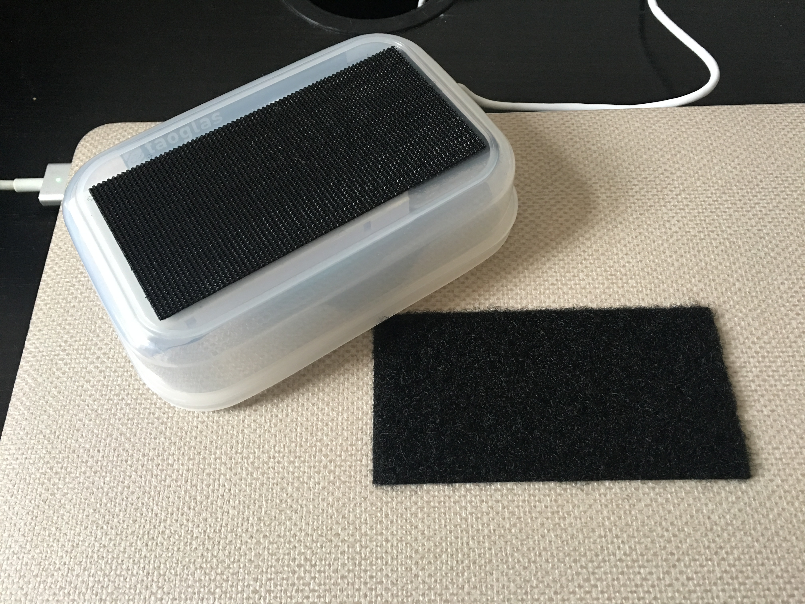

Felix Buchholz
MS Data Visualization @ Parsons NYC, Fall 2018, Data Structures, Aaron Hill

# Assignment 8

[Link](https://github.com/visualizedata/data-structures/tree/master/assignments/weekly_assignment_08) to the assignment description.

## My idea (Part two)

For this assignment I’m happy I got assigned my favorite sensor: the accelerometer. By [wikipedia’s](https://en.wikipedia.org/wiki/Accelerometer) definition it measures the the _acceleration of a body in its own instantaneous rest frame._

I’m using this sensor to track the movements of my laptop and my spatial interaction with it.

Rather than drawing exact diagrams of every day I want to draw imaginary paths of my day in 3D space. (With only one accelerometer and no GPS tracking, there is not enough data to make “real” paths, that would be (geo-)spatially correct)


I hope I can use three.js to create something similar to these drafts. Instead of drawing a every value in relation to the zero values of the axes, I want to draw every next value in relation to the previous one, creating these paths. The sum of the total difference could also determine the thickness of the path.

For a comparison between days I want to experiment with a small multiples approach and see if Mondays render a similar path for example. I also want to try an overlay approach.

## My setup (Part one)

### The device
To be mobile with my sensor I’m using particle’s Electron with a simcard, battery and cellular antenna instead of the photon. The setup is pretty straightforward and I don’t think I need to repeat [these](https://setup.particle.io/) instructions.

### Connecting the sensor to it

After soldering the accelerometer to its pins I connected the the sensor to the board according to this example image:


### Mounting it to my laptop

I used glued the electron in a small tupperware container and mounted it to my laptop using velcro (maybe I want to mount something else on it in the future)





### Flashing the device with the example code

Using the Web IDE called [_particle build_](https://build.particle.io/build/) I flashed my Electron with the started code.

```c
// -----------------------------------------
// Accelerometer
// -----------------------------------------

// In this example, we're going to register a Particle.variable() with the cloud so that we can read the level of an accelerometer sensor.

int z = A0; // This is the input pin where you read the Z value of the sensor.
int y = A1; // This is the input pin where you read the Y value of the sensor.
int x = A2; // This is the input pin where you read the X value of the sensor.

int analogval_z; // Here we are declaring the integer variable analogvalue, which we will use later to store the value of the sensor.
int analogval_y; // Here we are declaring the integer variable analogvalue, which we will use later to store the value of the sensor.
int analogval_x; // Here we are declaring the integer variable analogvalue, which we will use later to store the value of the sensor.

char json_str[50]; // A placeholder for a string of JSON

void setup() {

    // This lets the device know which pins will be used to read incoming voltages.
    pinMode(z, INPUT);
    pinMode(y, INPUT);
    pinMode(x, INPUT);

    // We are going to declare a Particle.variable() here so that we can access the value of the sensor from the cloud.
    Particle.variable("json", json_str);
    // This is saying that when we ask the cloud for "analogvalue", this will reference the variable analogvalue in this app, which is a double variable.

}

void loop() {

    // check to see what the value of the sensor is and store it in the int variable analogvalue
    analogval_z = analogRead(z);
    analogval_y = analogRead(y);
    analogval_x = analogRead(x);
    // provide access to a single variable, string in JSON format
    sprintf(json_str, "{\"z\": %u, \"y\": %u, \"x\": %u}", analogval_z, analogval_y, analogval_x);
    delay(50);

}
```

For now I’m using this starter code, but since I’m using the Electron and I want to save cellular data while collecting the sensor data, Therefore I should build a json_str that represents an array of data for a larger time interval, for example one hour. Then I can pull the information via the API every hour and I’ll have a better ratio of data compared to overhead.

Another suggestion was to only store min and max values of every minute and measure the actual values every tenth of a second.

I wrote some testing code in javascript to simulate finding one minimum value every minute:

```javascript
let mySeconds = 0;
let xMin = 10000;
let xMins = [];
function waitAndDo(times) {

  if(times < 1) {
    console.log(xMins)
    return;
  }

  setTimeout(function() {

    if (mySeconds < 60) {
      const x = Math.floor(Math.random().toFixed(3)*1000)
      if (x < mySeconds) {
        xMin = x;
      }
      const array = (x, new Date())
      // console.log(array);
      myMin++;
    } else {
      mySeconds = 0;
      xMins.push(xMin);
      xMin = 10000;
    }

    waitAndDo(times-1);
  }, 100);
}

waitAndDo(120)
```

For next week I’ll have to write the complete code in [_Wiring_](http://wiring.org.co/), or _C++_ for the particle device.

### My API link

[API-Link](https://api.particle.io/v1/devices/44002d001951353338363036/json?access_token=076b612811247cc031fd32b012a78b5d056a9e5b)

Result:

``` javascript
{
  "cmd": "VarReturn",
  "name": "json",
  "result": "{\"z\": 1959, \"y\": 2412, \"x\": 2057}", // this is the relevant line
  "coreInfo": {
    "last_app": "",
    "last_heard": "2018-11-09T17:55:51.725Z",
    "connected": true,
    "last_handshake_at": "2018-11-09T16:56:28.275Z",
    "deviceID": "44002d001951353338363036",
    "product_id": 10
  }
}
```
