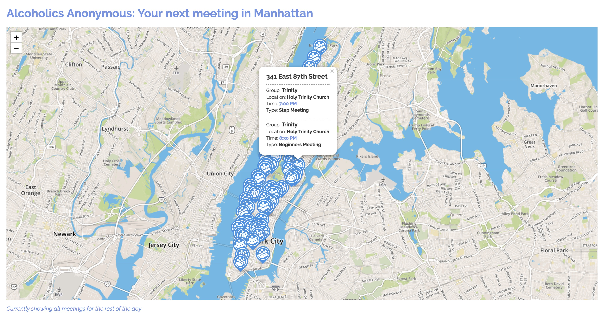
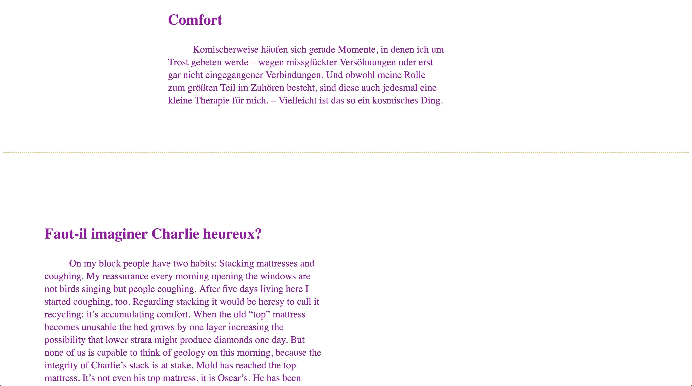

Felix Buchholz  
MS Data Visualization @ Parsons NYC, Fall 2018   
Data Structures, Aaron Hill

_For this documentation I focus on what happened form assignments ten and eleven to now and I give some context, but for more detailed descriptions it’s better to refer to previous assignments’ documentations._

Assignment 10: [Setting up the server & landing page for the final projects and endpoints with node & express](https://github.com/felixbuchholz/data-structures/tree/master/assignments/assignment10)  
Assignment 11: [Final designs and data methods for the semester projects](https://github.com/felixbuchholz/data-structures/tree/master/assignments/assignment11)

# Final Assignments 1 – 3

### [**Link to the landing page**](http://34.200.243.17:8080/)

_Styling is a bit peculiar – I like things a bit off, sorry._  
_And I get a bit disoriented when writing on a lot of different projects at the same time, I hope this is readable enough_

## Preparing the Server Environment

Between the two approaches to make the final endpoints and projects available over the internet, I opt for the first one and basically followed the [AWS Guide to _Share a Running Application over the Internet_](https://docs.aws.amazon.com/cloud9/latest/user-guide/app-preview.html?icmpid=docs_ac9_ide#app-preview-share). I think it’s easier to develop and maintain the code for these projects when I can see the results immediately and check the IP-address to check if everything works properly. 

I had a very brief glance at Elastic Beanstalk and I can imagine, if I had a bigger project, that I needed to deploy for a limited amount of time, I would give it a try – it seems like a fast and convenient option. For longterm projects it’s probably better to think about and research the appropriate structure more than just uploading the source code. [Find the current description of Beanstalk features](https://aws.amazon.com/elasticbeanstalk/details/) 


### File Structure and and server.js – Small Walkthrough

Here’s a tree of my file structure

``` shell
.
├── public
│   ├── assets
│   │   ├── icon.png
│   │   └── icon_shadow.png
│   ├── css
│   │   ├── diary.css
│   │   ├── landing.css
│   │   ├── map.css
│   │   └── sensor.css
│   ├── index.html
│   └── script
│       ├── aamap.js
│       ├── diary.js
│       ├── my3d.js
│       ├── OrbitControls.js
│       ├── sensorInterface.js
│       └── three.js
├── README.md
├── server.js
└── todo.md
```
_(Just here for later reference, if I need this in another cloud9 IDE – To make you feel like a macOS user in cloud9 there’s a fork of the very convenient package manager Homebrew, [Linuxbrew](http://linuxbrew.sh/), which I used to install [tree](http://mama.indstate.edu/users/ice/tree/) to make this beautiful tree view)_

I use a **one overall folder structure for all three projects.** The amount of files needed and the amount of code within each of those was still manageable enough, though the simplicity is almost stretched to its limits – I’m using four .js-files for the sensor data: The three.js library, it’s OrbitControls plugin, my3d.js to create a scene with my model of the sensor data and one to create the interface, using d3.js.  
If the projects get bigger I’d use a separate folder and subfolders for each project.

To avoid writing CSS and JavaScript and needing to restart the server on every little change I **outsourced the .css and .js** files and linked them in **the server.js file which holds the HTML structure in string variables.** The process follows the same principle for all final projects. The HTML-structure is split in two halves, the first one inside a script tag ending in:

``` javascript
var myHTMLFirstHalf = `
  <html> 
    (…)
    <script>
      var data =`;
```

The second half looks something like this:

``` javascript
var myHTMLSecondHalf = `;
    </script>
  (…)
  </html>
```

Both are joined with the result of the request in between: 

``` javascript
 client.query(thisQuery, (qerr, qres) => {
        if (qerr) { throw qerr }

        else {
            // *** The magic happens here ***
            var resp = myHTMLFirstHalf + JSON.stringify(qres.rows) + myHTMLSecondHalf; 
            // *** The magic ends here ***
            res.send(resp);
            client.end();
            console.log('2) responded to request for aa meeting data');
        }
    });
```

As Aaron mentioned in class, **this is not best practice**, not even a fairly good one, but one to show very directly what is happening and a good way to learn the process. In the future I guess it’s best to use a templating engine. A quick search suggested to look into [this guide](https://expressjs.com/en/guide/using-template-engines.html).

### The index.html

Please excuse the styling of the landing page – when styling is optional I always use the opportunity to make the design a playground and I kind of like weird designs and breaking some of the rules for readability for example (white typography on a very light background – sorry). 

The only other thing I added to the original code example are query extensions to the _Dear Judith_ and the _Laptop Wanderlust_ project url to start with the parameters I wanted to be passed to the queries first:

``` html
(…)
  <li><a href="/dd?ser=0">Dear Judith</a></li>
  <li><a href="/ss?off=1">Laptop Wanderlust</a></li>
(…)
```


## 1 – Alcoholics Anonymous: Your next meeting in Manhattan



#### [Live link](http://34.200.243.17:8080/aa)

### Previous Assignments

Links here to reference the readme of each assignment’s folder:

Assignment 1: [Asynchronous requests and first thoughts on how to parse the data.](https://github.com/felixbuchholz/data-structures/tree/master/assignments/assignment01-part1)  
Assignment 2: [Parsing the addresses for one zone from the requested data](https://github.com/felixbuchholz/data-structures/tree/master/assignments/assignment02)  
Assignment 3: [Geolocating the addresses with Texas A&M GeoServices API](https://github.com/felixbuchholz/data-structures/tree/master/assignments/assignment03)  
Assignment 4: [Plan the data model (mine hasn’t changed too much since then, except for naming and I left out neighborhoods and zones), setting up the communiction with the RDS on AWS and creating the appropriate rows](https://github.com/felixbuchholz/data-structures/tree/master/assignments/assignment04)  
Assignment 6, Part One: [Write a query to RDS](https://github.com/felixbuchholz/data-structures/tree/master/assignments/assignment06)  

### Level of Implementation 
**On Fridays (maybe on other days, too), a couple of my meetings unfortunately landed in Brooklyn.**
_I’m not sure why exactly that happened, because in my request to the TAMU Geo API I even included the zip code of the address._ 

``` javascript
(…)
    apiRequest += 'streetAddress=' + value.street.replace('58-66', '58').replace('206-208', '206').replace('’', '').split(' ').join('%20');
    apiRequest += '&city=New%20York&state=NY&zip=' + value.zipcode + '&apikey=' + apiKey;
(…)
```
Query: [Link to original assignment ](https://github.com/felixbuchholz/data-structures/blob/master/assignments/assignment07/03-geolocate.js)

_I’m sorry I won’t be able time-wise to get back to this and correct it before the deadline. The only approach that comes to mind right now to fix this would be to test the API with these adresses manually and write manual exceptions in the code._

Apart from that I’m quite happy with the the structure, amount of information and typography inside the markers, even though I have more detailed information on the meetings, I think that information would be better suited to be linked and displayed on a separate info page to each group. One small improvement would be a small wheelchair icon in the marker popup to indicate wheelchair access. (I might do that before the deadline, if I find the time)

Compared to my design intention it’s obvious that the user interface is missing. That would be the first step to take this further. 

Here’s the planned layout for comparison: 


[Link to a small write-up of all my design approaches for the final projects](https://github.com/felixbuchholz/data-structures/blob/master/assignments/assignment11/final-assignments-designs.pdf)


### My final query

As promised in the documentation for assignment ten, here’s my final query:

``` SQL
  SELECT addlat as lat, addlong as lon, json_agg(json_build_object('loc', locname, 'address', addstreet, 'time', datstart, 'name', groupname, 'day', datday, 'types', dattype, 'shour', dathour)) as meetings
  FROM dates
    JOIN meetings ON dates.datpk=meetings.meetdatefk
    JOIN locations ON meetings.meetlocationfk=locations.locpk
    JOIN groups ON meetings.meetgroupfk=groups.grouppk
    JOIN addresses ON locations.locaddressfk=addresses.addpk
    WHERE datday = '` + dayy + `' AND dathour >= ` + hourr +
   `GROUP BY addlat, addlong;
```

I’m using moment.tz to get the correct time for the _dayy_ and _hourr_ variables:

``` javascript
var now = moment.tz(Date.now(), "America/New_York").format('dddd,HH');

    var dayTimeArr = now.split(',');
    var dayy = dayTimeArr[0];
    var hourr = dayTimeArr[1]*100 // my dathour is in HHMM (2400) format 
    console.log(dayy);
    console.log(hourr);
```

### Code Features

The **custom icon** is referenced like this in Leaflet: 

``` javascript
var myIcon = L.icon({
    iconUrl: 'assets/icon.png',
    shadowUrl: 'assets/icon_shadow.png',

    iconSize:     [50, 50], // size of the icon
    shadowSize:   [50, 50], // size of the shadow
    iconAnchor:   [25, 50], // point of the icon which will correspond to marker's location
    shadowAnchor: [25, 50],  // the same for the shadow
    popupAnchor:  [0, -45] // point from which the popup should open relative to the iconAnchor
});
``` 

And must be passed as a parameter object to the marker: 

``` javascript
L.marker( [data[i].lat, data[i].lon], {icon: myIcon} /* here we go */)
  .bindPopup(myPopUp)
  .addTo(mymap);
```

**To structure the marker popup for each location** I’m using this code inside the original loop, that assigned the aggregated json object to locations, to **sort meetings by time** and **separate them in logical divs** that I then style in CSS. I only need the address once on top, that’s why I’m starting to build the html-string with that outside the forEach-loop:

``` javascript
    var sortedArray = data[i].meetings.sort(function (a, b) {
        if (a.shour < b.shour) {
          return -1;
        }
        if (a.shour > b.shour) {
          return 1;
        }
        return 0;
      })
    
    var myPopUp = [`<div class='address'>${data[i].meetings[0].address}</div>`];
    
    data[i].meetings.forEach((e,i) => {
      myPopUp.push(`
      <div class='meeting'>
        <div class='name'>
          Group: <span class='em'>${e.name}</span>
        </div>
        <div class='loc'>
          Location: <span class='em'>${e.loc == ''? '–' : e.loc}</span>
        </div>
        <div class='time'>
          Time: <span class='em'>${e.time}</span>
        </div>
        <div class='types'>
          Type: <span class='em'>${e.types}</span>
        </div>
      </div>
      `)
    })
    myPopUp = myPopUp.join('');
```

## 2 – Dear ~Diary~ Judith,



#### [Live link](http://34.200.243.17:8080/dd?ser=0)


### Previous Assignments

Links here to reference the readme of each assignment’s folder:

Assignment 5: [Planning the data model and first design draft](https://github.com/felixbuchholz/data-structures/tree/master/assignments/assignment05)  
Assignment 6, Part Two: [Writing a query to DynamoDB, corrected the data model](https://github.com/felixbuchholz/data-structures/tree/master/assignments/assignment06)  

### Level of Implementation

This is just a very bumpy prototype – literally, it bumps, when loading the next series of entries and appending them to the DOM. But the basic loading on scroll works, as I imagined. I diverged a bit form my original plan to load every single subentry after the other, instead I’m loading a whole set. 

I’m not using my tags yet to style the individual entries, but that would be the next step in the .html method to use ${template partials} to include them in the class attribute of each div-tag. This would be my first step to take this further. I’m really enjoying the separation of content and structure and design for this project and it is a great motivation to expand this project. I think to look at all three components separately allows for more freedom in each dimension. I really enjoyed that in this project.

### Final Query

The reason why I’m loading a whole subset of entries at a time is to avoid keeping track of when a series ends, which was quite prone to error. I’m only querying the database for a single series of entries at a time and the results are pushed and stored into a variable which is only reset when the user nevigates to the original url:

``` javascript
app.get('/dd', function(req, res) {
    var series = req.query.ser;
    // var sequence = req.query.seq; /* decided against loading sub-entries sequentially */
    
    // Default: ?ser=0, resets the myData array
    if (series == 0) {
      myData = [];
      checkSeries = 0;
    }
    
    // AWS DynamoDB credentials + Connect to the AWS DynamoDB database
    (…)
    
    var params = {
        TableName : "deardiary",
        KeyConditionExpression: "series = :series",
        ExpressionAttributeValues: {
            ":series": {N: `${series}`}
        }
    };

    dynamodb.query(params, function(err, data) {
        if (err) {
            console.error("Unable to query. Error:", JSON.stringify(err, null, 2));
        }
        else {
            if (series == checkSeries) {
              myData.push(data.Items)
              checkSeries++;
            }
            var resp = d1x + JSON.stringify(myData) + d2x;
            console.log(resp)
            res.send(resp);
            console.log('3) responded to request for dear diary data');
        }
    });

});
```

### Code Features 

The nested data array holds all the information to control the page:

I use d3 to loop through the first hierarchy level with .selectAll and .data. The second hierarchy level is processed with the .each method combined with the previous two. The first hierarchy level results only in DOM structure, the second level holds and appends the content. 

``` javascript
d3.select('body')
  .selectAll('div')
  .data(data).enter() // data is the looped through --- hierarchy: 1
    .append('div')
    .attr('class', (…))
    .attr('id', (…))
    .each(function (p, j) { // each element of hierarchy 1 --- hierarchy: 2
      d3.select(this)
        .selectAll('div')
        .data(p) // p is looped through here
        .enter()
        .append('div')
        .attr('class', (…))
        .style('padding-left', function(d, i) {
          return `${i*100}px`
        }) // Every subentry is indented here
        .html(function(d, i) {
          // console.log (d, i)
          return `
          <h2>${d.headline.S}</h2> // Content is finally bound to the DOM
          ${d.entry.S.trim()}
          `
        })
    })
```

Even before that, I check if the last query (queries) appended an empty array to the data (which means the query had no result). If it tests true I add a custom element which I use to indicate that the page ends there:

``` javascript
for (var i = 0; i < data.length; i++) {
  if (!data[i].length) {
   data[i] = [{'end': true, 'headline': {'S': 'Undefined.'}, 'entry': {'S': 'C’est la fin, mon ami.'}}];
  } 
}
```

To inform the user that the page extends on scrolling I added a note on the last div element:

``` javascript
d3.selectAll('div').style('margin-bottom', null);
var lastChild = d3.select('body:last-child');
console.log(lastChild)
// to have offset to scoll back up I need this margin, 
// see explanation below on bumpiness
lastChild.style('margin-bottom', '300px') 


lastChild.append('div').text(function(d, i) {
  console.log(this)
  return 'Unless this is the end, keep scrolling'
}).classed('scroll', true)
```

Even after the first notice appears the user can continue to produce more of them by scrolling. I like this, but it could also be easily changed by setting a flag after the first appearance of an empty array and then test if that variable tests for true before appending the note.

**The rest of the code is just interface for the site** and probably not that relevant for the data structure perspective, it basically works like this: On every scroll event the scroll position is compared to total page height, if they are equal, a new page is loaded with the query extension of the next series (here the length of the data array comes in handy):

``` javascript
if (scroll_pos+viewportHeight == pageHeight) {
    window.location.href = `http://34.200.243.17:8080/dd?ser=${data.length}`;
```

**The reason why the whole thing is bumpy is,** because the immediately after loading the new page I scroll to the top of the added series:

``` javascript
var latestScrollPosition = document.getElementById(`${data.length-1}`).getBoundingClientRect().top

window.scrollTo({
  // This is the offset preventing an infinite loop of queries and reloads
  top: latestScrollPosition-650, 
    left: 0
});
```

But to not get caught up in an infinite reloading loop I have to offset the scroll, especially at the end, when the height of the note is not enough and the condition scroll_pos+viewportHeight == pageHeight would immediately be met.


## 3 – Laptop Wanderlust


#### [Live link](http://34.200.243.17:8080/ss?off=1)

### Previous Assignments

Links here to reference the readme of each assignment’s folder:

Assignment 8: [Setting up the sensor, checking the API-Link and drafting the user-interface idea](https://github.com/felixbuchholz/data-structures/tree/master/assignments/assignment08)  
Assignment 9: [Writing the proper micro controller code, writing to the RDS and checking the result](https://github.com/felixbuchholz/data-structures/tree/master/assignments/assignment09)  


### Level of implementation

I think this is pretty close to what I wanted to do, except there is no direct comparison of the shapes over a couple of days, but seeing them now I think there might not be yet be enough shapes to compare, current count is 20, so only 2 – 3 per day of the week. Right now it seems that weekends tend to create  shapes that are more flat. Unfortunately there are also a couple of days where I realized to late that the sensor is not writing “good” data to the database

### Final Query

The query hasn’t changed much, except for two things: I corrected the date handling with moment.tz a bit and I’m using it’s functionality to pass a nicely formatted date string. Hence, I had to split up the html string in 3 variables. The second part is that I’m using the url query extension to calculate the offset to today:

``` javascript
app.get('/ss', function(req, res) {
  
    var offset = req.query.off;

    // Connect to the AWS RDS Postgres database
    const client = new Pool(db_credentials);
    
    var d = new Date();
    d.setDate(d.getDate() - offset);

    var ydd = moment.tz(d, "America/New_York").format('D');
    var ydm = moment.tz(d, "America/New_York").format('M');
    var myDate = [moment.tz(d, "America/New_York").format('dddd, MMMM Do YYYY'), d];
    console.log(ydd, ydm);
    // SQL query
    var q = `SELECT * FROM sensorData
              WHERE day ='${ydd}' AND month ='${ydm}';`;

    client.connect();
    client.query(q, (qerr, qres) => {
        if (qerr) { throw qerr }
        else {
            var resp = s1x + JSON.stringify(qres.rows) + s2x + JSON.stringify(myDate) + s3x;
            res.send(resp);
            client.end();
            console.log('1) responded to request for sensor graph');
        }
    });
});
```

Queries and page reloading are handled in the sensorInterface.js by clicking on the “prev” and “next” buttons, which are only available within the offset ranges, that data was recorded:

```javascript
// startDate is assigned earlier, I started on 2018-11-25T05:00:00.000Z
if (currentDate > startDate) { 
  d3.select('body')
    .append('div')
      .attr('id', 'previous')
      .text('prev')
      .on('click', function() {
        window.location.href = `http://34.200.243.17:8080/ss?off=${offset+1}`;
      })
}
if (offset > 0) { // Offset 0 means today, default is 1
  d3.select('body')
  .append('div')
    .attr('id', 'next')
    .text('next')
    .on('click', function() {
      window.location.href = `http://34.200.243.17:8080/ss?off=${offset-1}`;
    })
}
```
The default offset is 1, resulting in yesterdays path, because if the site is requested earlier during the day, there might be not enough day to see a proper path. 


### Code Features

Ideally my data array would contain 1440 rows or objects respectively but that is rarely true, because I only request data from my micro controller every 15 minutes and only has a cellular connection, I loose data whenever the micro controller is not online at that specific moment. I’m already storing redundant data on the controller, but haven’t yet implemented requesting and storing it, if the previous request failed.

To draw a path in a 3 dimensional coordinate system I had to decide, what I want to do with my acceleration data. My end result should be vertices with x, y and z coordinates which is what three.js and the specific method I use, needs to create the path:

``` javascript
var path = new THREE.CatmullRomCurve3(vertices);
```

I broadly described the process of using an average and subtracting that average from every value in assignment 11:


This is to deal in a very associative way with the fact, that I’m constantly measuring acceleration due to earth’s gravitational force. With just one accelerometer there’s unfortunately no way to account for the fact that this force is of course constantly present in different proportions of my x, y and z values, because the rotation of my sensor in relation to earth’s gravitational field constantly of changes. 

I chose to think of my acceleration values as vectors and starting with the first one I iteratively add them up to calculate vertices as waypoints. Looking at my data I realized, that I have a lot of subsequent rows with exactly the same values. For these cases I thought I could reduce the amount of waypoints by adding these vectors up to describe one large vector connecting two waypoints.

I described this in the in the code as smoothing, because the path generator that I use in three.js actually interpolates a curve around the waypoints, and with less waypoints this curve gets a bit more freedom to connect the remaining ones.


**Averaging** 
``` javascript
let xmins = data.map(a => a.xmini);
let xmaxs = data.map(a => a.xmaxi);
let xavg = [d3.mean(xmins), d3.mean(xmaxs)]
let ymins = data.map(a => a.ymini);
let ymaxs = data.map(a => a.ymaxi);
let yavg = [d3.mean(ymins), d3.mean(ymaxs)]
let zmins = data.map(a => a.zmini);
let zmaxs = data.map(a => a.zmaxi);
let zavg = [d3.mean(zmins), d3.mean(zmaxs)]
``` 

**Smoothing**
``` javascript
let vectors = [];
let vectorsSmooth = [];
let aggregateVector = [ 0, 0, 0 ];
let counter = 0;

data.forEach((e, i) => {
  let x, y, z;
  x = (e.xmini + e.xmaxi)/2 - d3.mean(xavg);
  y = (e.ymini + e.ymaxi)/2 - d3.mean(yavg);
  z = (e.zmini + e.zmaxi)/2 - d3.mean(zavg);
  vectors.push( [x, y, z] )
})

vectors.forEach((e, i) => {
  if (arraysEqual(vectors[i], vectors[i+1])) {
    aggregateVector[0] += vectors[i][0]; // aggregateVector[0] = x;
    aggregateVector[1] += vectors[i][1]; // aggregateVector[1] = y;
    aggregateVector[2] += vectors[i][2]; // aggregateVector[2] = z;
    counter++;
  } else {
    aggregateVector[0] += vectors[i][0]; // aggregateVector[0] = x;
    aggregateVector[1] += vectors[i][1]; // aggregateVector[1] = y;
    aggregateVector[2] += vectors[i][2]; // aggregateVector[2] = z;
    if (onlyChanges) {
      if (counter > 0) {
        aggregateVector[0] = aggregateVector[0]/counter;
        aggregateVector[1] = aggregateVector[1]/counter;
        aggregateVector[2] = aggregateVector[2]/counter;
      }
    }
    vectorsSmooth.push(aggregateVector);
    counter = 0;
    aggregateVector = [ 0, 0, 0 ];
  }
})
vectors = vectorsSmooth;
```

**Calculating the vertices**
``` javascript
let vertices = [];
vertices[0] = [ 0, 0, 0 ];
for (var i = 0; i < vectors.length; i++) {
    let nextx, nexty, nextz;
    nextx = vertices[i][0] + vectors[i][0]/myScale;
    nexty = vertices[i][1] + vectors[i][1]/myScale;
    nextz = vertices[i][2] + vectors[i][2]/myScale;

    const nextVertex = [nextx, nexty, nextz];

    // array1 = vertices[i-1];
    // array2 = vectors[i];
    //
    // let nextVertex = array1.map(function (num, idx) {
    //                   let res = (num + array2[idx])/10;
    //                   res = parseFloat(res.toFixed(1));
    //                     return res;
    //                   });

    vertices.push(nextVertex);

}
```

In the end I’m centering the whole path: 

```javascript
const xCooArr = vertices.map(x => x[0]);
const xCenter = (d3.min(xCooArr) + d3.max(xCooArr))/2;
const yCooArr = vertices.map(x => x[1]);
const yCenter = (d3.min(yCooArr) + d3.max(yCooArr))/2;
const yMin = d3.min(yCooArr);
const zCooArr = vertices.map(x => x[2]);
const zCenter = (d3.min(zCooArr) + d3.max(zCooArr))/2;
```

After creating the three.js vector object, …

``` javascript
vertices = vertices.map((x) => {
  res = new THREE.Vector3(x[0], x[1], x[2]);
  return res;
})
```

… the rest of the script is only related to creating the canvas, setting the scene, light, shadow, material and camera objects in three.js. I used [this example as a codebase](https://threejs.org/examples/#webgl_lights_spotlight)

## Conclusion

It was a great experience to work on this, sometimes requested a bit of faith when working through it but really rewarding when it all came together and understanding how all parts together. Not only is this motivating to continue working on these projects but I can also see in what different ways future projects can benefit by incorporating a database and a backend and a lot of those ways I couldn’t have imagined before. 

